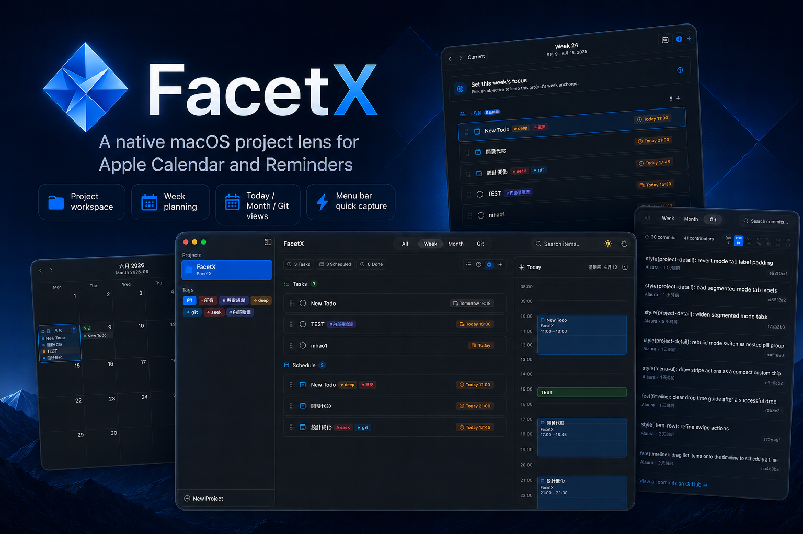

# FacetX



FacetX is a native macOS project workspace for Apple Calendar and Reminders.

Tasks and events continue to live in Apple's apps and sync through iCloud.
FacetX adds the project layer: it gathers Calendar and Reminders items whose
titles start with a project prefix, then presents each project as a focused
workspace for planning, capture, review, and delivery.

Current release: **v1.0 release**.

## What It Does

- Project workspaces combine reminders, scheduled events, and project metadata.
- Today timeline shows cross-project work without moving data out of EventKit.
- Plan view combines a month map, weekly focus, and day-by-day scheduling.
- Week goals are backed by calendar events, so planning remains visible outside
  FacetX.
- Menu bar quick capture creates prefixed reminders or events without opening
  the main window.
- Tags, manual ordering, completed-item filters, and project appearance metadata
  keep active work scannable.
- The Git workspace provides a yearly activity heatmap, staged and unstaged
  changes, diffs, commits, branch and remote actions, and Todo/Event backlinks.
- Settings control source containers, save defaults, integrations, general
  behavior, and keyboard shortcuts.

## Data Model

EventKit remains the source of truth. FacetX stores only project-side metadata
under Application Support, such as project names, editable prefixes, week goals,
sidebar ordering, item ordering, visual appearance, and optional GitHub repo
links. Reminder and calendar item content is not copied into a FacetX database.

An item belongs to a project when the first line of its title starts with that
project's prefix:

```text
Regulus: Fix launch authorization flow    -> project "Regulus"
调研：整理论文列表                         -> project "调研"
Inbox item without a known prefix          -> ignored by FacetX
```

Reads accept both ASCII `:` and fullwidth `：`; writes always use ASCII `:`.
Items without a recognized project prefix are ignored and never modified.

## Build And Run

```bash
make run      # debug rebuild, codesign, stop the current app, relaunch
make build    # release bundle build
make check    # SwiftPM debug build + FacetXCoreChecks
make dmg      # package app/FacetX-<version>.dmg
make clean    # remove local build and packaging artifacts
make logs     # stream FacetX OS logs
```

FacetX must run as a bundled, signed `.app`; a bare SwiftPM executable is denied
EventKit access by macOS. Development builds reuse Calendar and Reminders
authorization when the bundle ID and signing identity stay stable.

If the build output says `signing: ad-hoc`, macOS may ask for Calendar and
Reminders authorization again after rebuilds. If macOS asks for the login
keychain password during a signed build, that is `codesign` requesting access to
the local Apple Development private key; choose Always Allow for `codesign` to
avoid repeated build-time prompts.

## Release

FacetX release packaging is local and not notarized. The release flow is:

```bash
make check
make build
make dmg
codesign --verify --deep --strict --verbose=2 app/FacetX.app
```

The DMG is written to `app/FacetX-<version>.dmg`. Version metadata lives in
`app/Info.plist`.

## Documentation

- [Architecture](docs/ARCHITECTURE.md)
- [Building](docs/BUILDING.md)
- [Release](docs/RELEASE.md)
- [Agent guide](AGENTS.md)
